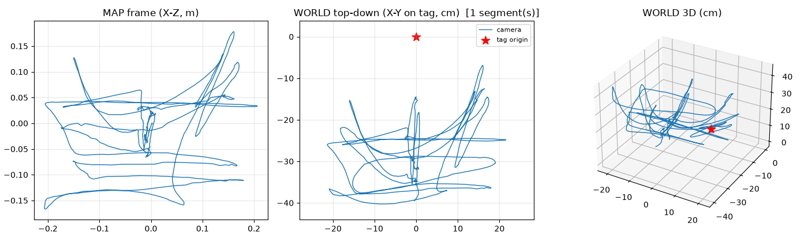
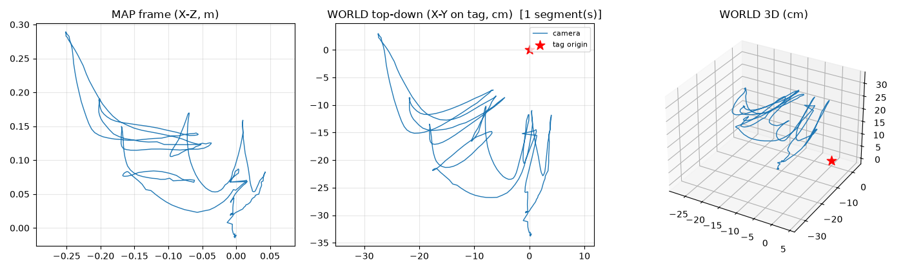
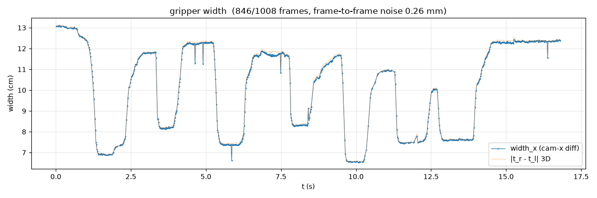
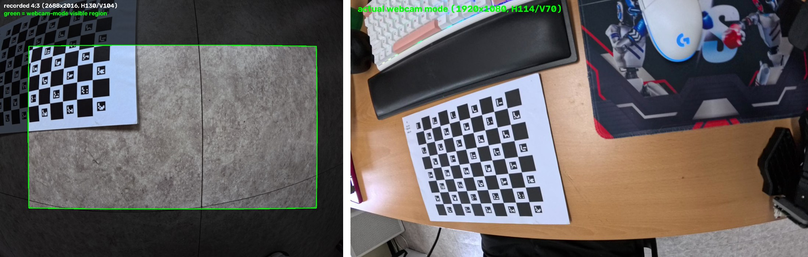
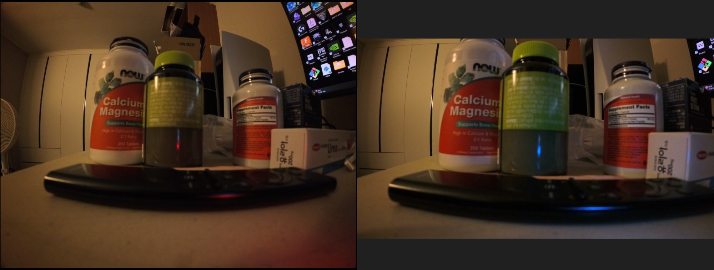

# Insta360 Ace Pro 2


| 샘플 (복도) | 샘플 (공원) | 캘리브레이션 보드 |
|---|---|---|
|  |  |  |

## 측정 스펙 (이 데이터셋에서 실측)

| 항목 | 값 |
|---|---|
| 영상 모드 | 2688×2016 (4:3) @ 59.94 fps, **HEVC** |
| **FOV (실측)** | **H 130.1° / V 104.0° / D 152.3°** |
| 텔레메트리 | MP4 **트레일러**(파일 끝, ffprobe에 안 보임) — [telemetry-parser](https://github.com/AdrianEddy/telemetry-parser)로 추출 |
| IMU | **994 Hz** (gyro deg/s, accl m/s² — `insta360.py`가 단위 자동 감지) |
| 가속도계 품질 | \|g\| = 9.72~9.93 m/s² (**~1% 스케일 오차** — HERO7의 1/3) |
| IMU-영상 시간 오프셋 | **-2.3 ms** (telemetry-parser 타임스탬프가 거의 정확) |
| 안정화 | FlowState OFF 필수 (배럴 왜곡 보존 여부로 확인 가능) |

## 설치 특이사항 — telemetry-parser (Python 3.13)

pypi 버전(0.1.7)은 의존성이 깨져 있어 git 소스 빌드가 필요:

```bash
conda install -c conda-forge rust          # Rust ≥1.85 (edition 2024)
pip install -U maturin                     # 패키지의 구버전 maturin 고정 우회용
git clone --depth 1 https://github.com/AdrianEddy/telemetry-parser.git /tmp/tp
PYO3_USE_ABI3_FORWARD_COMPATIBILITY=1 \
  pip install /tmp/tp/bin/python-module --no-build-isolation
```

## 캘리브레이션 (KB4 fisheye)

- fx=993.4 (v527) / 991.2 (v526) — **독립 보드 영상 두 개가 0.2% 이내 일치**
- RMS 0.823 / 0.748 px
- **FOV: H 130.1° / V 104.0° / D 152.3°** — HERO7보다 수평 +10°
- 커버리지: 68/80 셀 (v527)


## 결과

| 영상 | 환경 | 결과 |
|---|---|---|
| VID_525 | 실내 복도 | **99.9% 추적, 실패 0회**, 124 m (65 m 복도 왕복) + 맵 |
| VID_528 | 연못 공원 (주간) | **99.75%, 실패 0회**, 399 m + 맵(1398 KF, 68k점) |
| VID_520 | **지하주차장 (저조도)** | **99.8%, 실패 0회**, 106 m + 맵(261 KF, 22k점) |
| VID_521 | **야간 연못 공원 (저조도)** | **98.8%**, RECENTLY_LOST 1프레임, 153 m 루프 + 맵(330 KF, 21k점) |
| VID_526/527 | 보드(캘리브레이션) | 근거리 ATE 검증에 사용 |

**저조도 성능**: 주차장(인공조명 고대비 텍스처)과 야간 공원(가로등/조명 스트링)
모두 사실상 무손실로 추적 — 큰 센서(1/1.3")의 게인 노이즈 억제 효과.
저조도의 실제 비용은 실패가 아니라 **드리프트 증가**로 나타남(야간 공원 수직
~12 m, 루프 클로저 미발동 기준). 528(주간)과 521(야간)은 같은 장소라
**주/야간 페어 벤치마크**로 사용 가능.


**근거리 정밀도** (ChArUco 기준 대비, VID_526 36초 전체):
ATE **RMSE 1.23 cm** (rigid) / 0.47 cm (similarity, 스케일 계수 1.067)


**야외 드리프트** (VID_528, 399 m, 루프 클로저 미발동 = 순수 오도메트리):
재방문 일관성 중앙값 1.82 m, 수직 드리프트 0.8 m (0.2%)

### UMI 그리퍼 검증 (2026-07-07)

그리퍼에 장착해 화면 하단 36%를 마스킹한 상태로 **데모 4/4편(여닫음·
pick&place·던지기·혼합) 100% 추적, 전부 단일 세그먼트**. 그리퍼 장착
맵(id13 앵커, 태그 잔차 0.25 cm) + 130° FOV 조합의 효과 — 상세 분석과
FOV 크롭 통제 실험은 [UMI 검증 문서](../../docs/umi_gripper_pipeline.md).





## 웹캠 모드 (UVC) — VLA 롤아웃용

USB 연결 시 표준 UVC로 인식됩니다 (Ubuntu 드라이버 불필요):

```
/dev/v4l/by-id/usb-Arashi_Vision_Insta360_Ace_Pro_2_0001-video-index0
```

| 항목 | 웹캠 모드 | 녹화 모드 |
|---|---|---|
| 포맷 | MJPG 640×360 / 1280×720 / **1920×1080 @30fps** (+H.264 1080p), 전부 16:9 | 2688×2016 4:3 @59.94 |
| **FOV (실측)** | **H 114.3° / V 70.0° / D 126.7°** | H 130.1° / V 104.0° / D 152.3° |
| 왜곡 | **부분 디워핑** (KB4로 모델링, RMS 0.28 px) | fisheye 원본 |
| IMU | **없음** (UVC에 IMU 채널 없음 — 텔레메트리는 녹화 파일 전용) | 994 Hz |
| **종단 지연 (실측)** | **median 163 ms** (p10 145 / p90 185, glass-to-host, `gopro_vio.latency_test`) | — |

캘리브레이션: `calibration/webcam/` (보드 영상 2편 병합 — 중심부+가장자리,
커버리지 55/80셀, 전 프레임 재투영 0.35 px).

### 웹캠 모드에서 잘리는 영역 (데이터 수집 가이드)

녹화(4:3) 화면 위에 웹캠 모드에서 보이는 영역(초록 경계)을 오버레이한 비교:



같은 장면 실촬영 비교 — 녹화 모드(좌) vs 웹캠 모드(우):



- 웹캠 뷰 = 녹화 프레임의 **53.5%** (좌우 각 8%, **상하 각 18~19% 잘림**)
- 각도 기준: 광축에서 수평 ±57°, 수직 ±35° 밖의 피처는 롤아웃에서 안 보임
- **수집 규칙**: 조작 대상·그리퍼가 녹화 화면의 **중앙 2/3 세로 밴드** 안에
  유지되도록 카메라 각도를 잡을 것 (수평은 관대, 수직이 빡빡함).
  리매핑 결과 영상을 미리 확인하는 습관 권장 — 그 영상에 보이는 것만
  정책이 관측한다.

### 학습↔롤아웃 도메인 정렬 (remap)

웹캠 FOV ⊂ 녹화 FOV이므로 **녹화 영상을 웹캠 기하로 정확히 변환**할 수 있습니다
(같은 렌즈의 두 투영 모델 간 픽셀 단위 재투영):

```bash
python -m gopro_vio.remap data/acepro2/VID_..._528.mp4 \
    --src-calib cameras/acepro2/calibration/v527/intrinsics.json \
    --dst-calib cameras/acepro2/calibration/webcam/intrinsics.json \
    -o output/acepro2_528/webcam_view.mp4 --fps-div 2
```

폐루프 검증: 리매핑된 녹화 영상의 ChArUco 코너가 웹캠 캘리브레이션과
**0.55 px** 이내로 일치 — 기하 도메인 갭이 캘리브레이션 오차 수준으로 닫힘.
VLA 학습 데이터는 이 변환을 거치면 롤아웃 UVC 스트림과 동일 기하가 됩니다
(잔여 갭은 노출/색처리 등 포토메트릭 요소).

주의사항:
- 웹캠 모드는 IMU가 없으므로 VIO 불가 — 이미지 관측만 쓰는 정책 롤아웃 전용
- **UVC 시야(114°)는 카메라 LCD 프리뷰(녹화 시야 130°)보다 좁음** — LCD에
  보인다고 스트림에 잡히는 게 아님
- 관측 지연 163 ms는 정책의 관측-행동 타임스탬프 정렬에 보정 상수로 반영 권장

## HERO7 대비

| | Ace Pro 2 | HERO7 Black |
|---|---|---|
| 근거리 ATE (rigid) | **1.23 cm** | 1.88 cm |
| IMU 스케일 오차 | **6.7%** | 12.6% |
| 같은 공원 추적률 | **99.75% / 실패 0회** | 91.5% / 실패 40회 |
| IMU 레이트 | **994 Hz** | 197.7 Hz |
| FOV (H / V / D) | **130.1° / 104.0° / 152.3°** | 120.5° / 93.7° / 146.6° |

## 알려진 한계

- 보드 초근접(화면 전체가 근접 평면) 구간에서 스케일 폭주 — HERO7과 동일하게
  재현됨: **카메라와 무관한 mono-inertial 공통 한계** (VID_527의 24-42s)
- 994 Hz IMU는 현재 200 Hz로 리샘플되어 SLAM에 공급 — 고레이트를 살리는
  백엔드(Basalt 등) 비교는 TODO

## 사용법

```bash
python -m gopro_vio.insta360 data/acepro2/VID_..._527.mp4 -o output/acepro2_527
python -m gopro_vio.charuco data/acepro2/VID_..._527.mp4 -o cameras/acepro2/calibration/v527 \
    --squares 10 8 --square-size 0.023
python -m gopro_vio.imu_sync cameras/acepro2/calibration/v527/board_poses.npz \
    output/acepro2_527/imu.csv -o cameras/acepro2/calibration
python -m gopro_vio.slam data/acepro2/VID_..._525.mp4 --imu output/acepro2_525/imu.csv \
    -o output/acepro2_525/slam --calib cameras/acepro2/calibration/v527/intrinsics.json \
    --extr cameras/acepro2/calibration/imu_extrinsics.json
```
