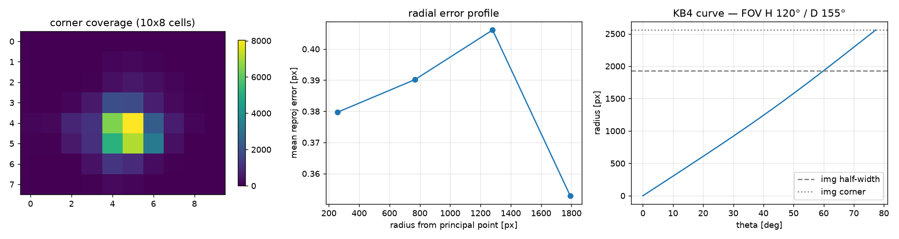
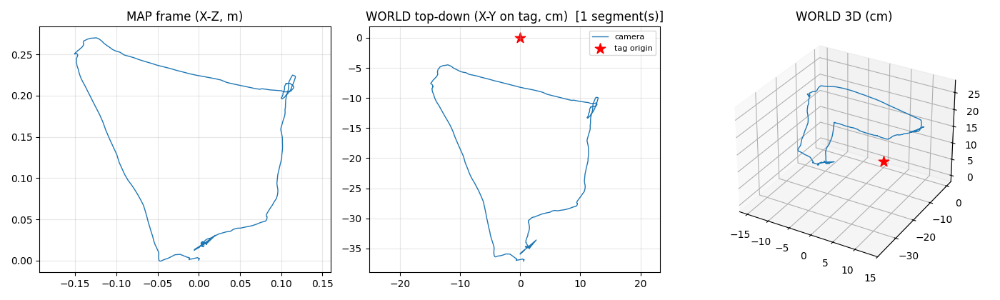
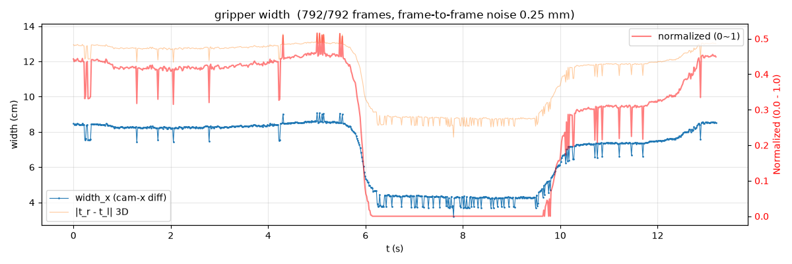

# GoPro HERO13 Black

> 상태: ORB-SLAM3 mono-inertial 파이프라인 **동작 확인 완료**. 검증은 UMI
> 그리퍼 근거리 에피소드(각 ~13 s) 기준이며, 장거리 실외 궤적·아틀라스 병합
> 스트레스·ChArUco 근거리 ATE는 아직 미측정입니다(아래 [알려진 한계](#알려진-한계)).

## 측정 스펙 (이 데이터셋에서 실측)

| 항목 | 값 |
|---|---|
| 영상 모드 | 3840×3360 (4:3) @ 59.94 fps, H.264 |
| **FOV (실측)** | **H 119.8° / V 106.0° / D 154.6°** |
| 텔레메트리 | MP4 `gpmd` 트랙 (GPMF) — `gopro_vio.extract`로 추출 |
| IMU | ACCL/GYRO **≈ 202 Hz** (에피소드 샘플 기준 실측) |
| 가속도계 품질 | \|g\| = **9.89 m/s²** (+0.8% 스케일, 중력 정렬 잔차 spread 0.34) |
| IMU-영상 시간 오프셋 | **+2.9 ms** (imu_sync 자동 추정, corr peak 0.39) |
| 안정화 | HyperSmooth **OFF 필수** |

## 캘리브레이션 (KB4 fisheye)

- fx=1732.4, fy=1736.8, cx=1912.1, cy=1675.9 / k1~k4 = 0.0373, 0.0490, -0.0338, 0.0062
- RMS **0.397 px** (60뷰), 전 프레임 재투영 평균 0.39 px / p95 0.85 px — 가장자리 발산 없음
- **FOV: H 119.8° / V 106.0° / D 154.6°**
- 커버리지: 10×8 셀 중 **33셀**에만 100+ 샘플 (hero7black 78셀 대비 낮음 → 아래 한계 참조)



## 결과

UMI 그리퍼 장착 + 하단 마스킹(`calibration/gripper_mask.png`) 상태에서 촬영한
근거리 조작 에피소드를 `orb_slam3:gate28-rescue`로 처리 (mono-inertial,
width 960 / features 2500 / fps-div 2).

| 샘플 | 포즈 | 추적률 | 월드 대각 | 스케일(map/m) | 재로컬 | 추적실패 |
|---|---:|---:|---:|---:|---:|---:|
| episode_21 | 396 | **100%** | 0.44 m | 0.964 | 1 | 0 |
| episode_28 | 406 | **100%** | 0.37 m | 0.964 | 1 | 0 |

두 샘플 모두 `validation.passed = true`, 단일 연속 세그먼트 100% 추적, 아틀라스
정상 로드. 태그 월드 앵커 정렬 및 그리퍼 너비 신호 생성까지 end-to-end 확인.




전체 통계는 `results/trajectory_episode{21,28}_stats.json` 참조.

## 알려진 한계

- **근거리 ATE 미측정**: ChArUco mm급 기준 대비 rigid ATE(README 지원표의 지표)를
  아직 촬영·평가하지 않음. hero7black/acepro2와 직접 비교하려면 `gopro_vio.board_eval`
  실행 필요.
- **장거리·저텍스처 미검증**: 검증이 ~13 s 근거리 조작 영상에 한정. 실외 보행
  장거리 궤적이나 무지 벽 구간의 아틀라스 분절 거동은 미확인.
- **캘리브 커버리지 낮음**: 33/80 셀만 100+ 샘플 → 프레임 가장자리 왜곡 계수가
  덜 제약됨. 보드 영상을 화면 가장자리까지 더 채워 재캘리브 권장.
- 카메라/샘플 실물 사진(`images/`) 미포함.

## 사용법

```bash
# 1. IMU 추출
python -m gopro_vio.extract data/hero13black/GX010035.MP4 -o output/GX010035

# 2. 캘리브레이션 (ChArUco 10×8, 0.023 m)
python -m gopro_vio.charuco data/hero13black/GX010009.MP4 -o cameras/hero13black/calibration \
    --squares 10 8 --square-size 0.023

# 3. IMU-카메라 정렬
python -m gopro_vio.imu_sync cameras/hero13black/calibration/board_poses.npz \
    output/GX010035/imu.csv -o cameras/hero13black/calibration

# 4. VIO (ORB-SLAM3 mono-inertial)
python -m gopro_vio.slam data/hero13black/GX010035.MP4 --imu output/GX010035/imu.csv \
    -o output/GX010035/slam --calib cameras/hero13black/calibration/intrinsics.json \
    --extr cameras/hero13black/calibration/imu_extrinsics.json \
    --width 960 --features 2500 --fps-div 2
```
