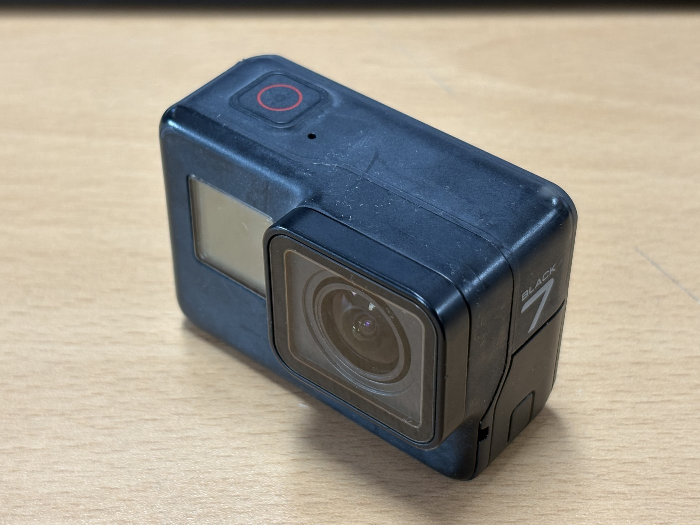
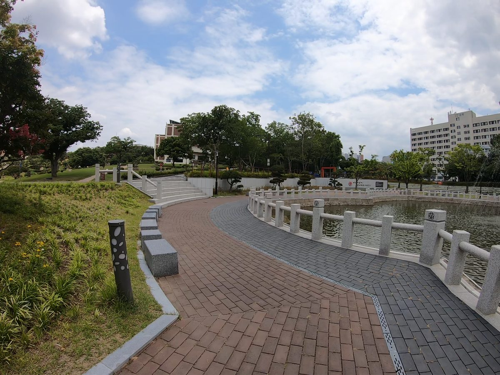
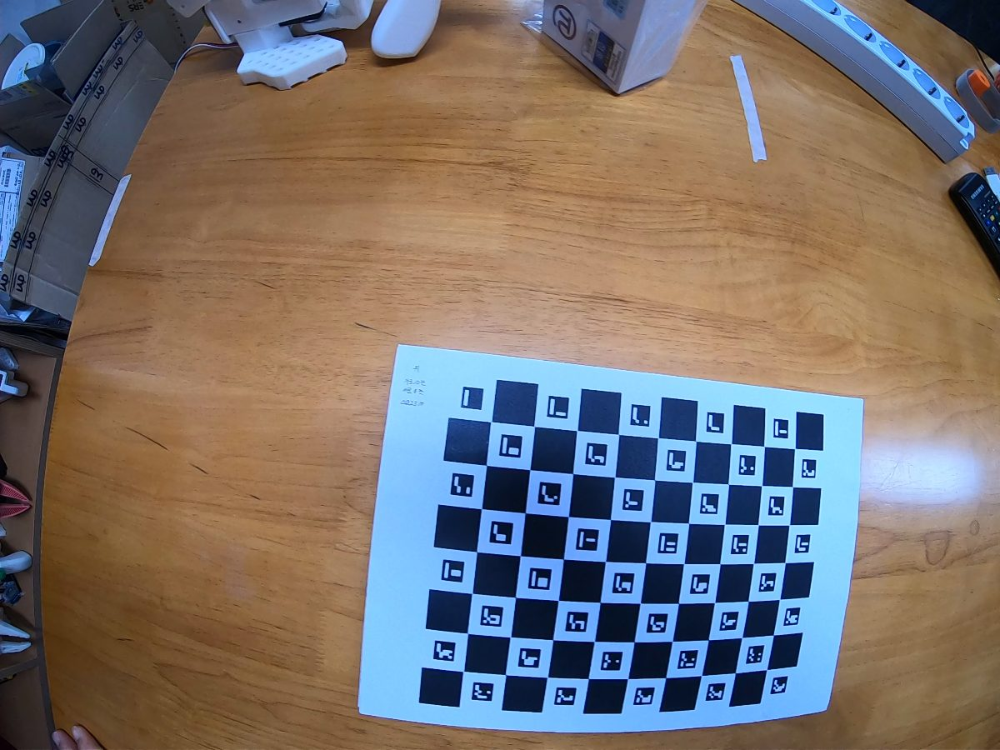
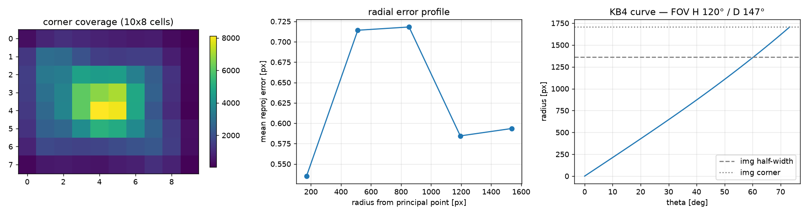
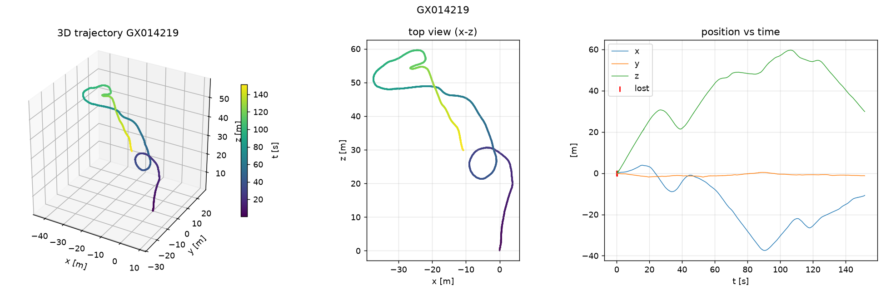
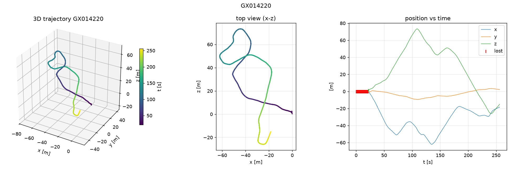
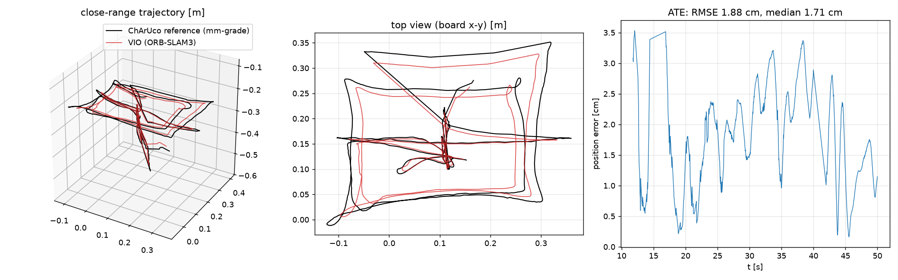
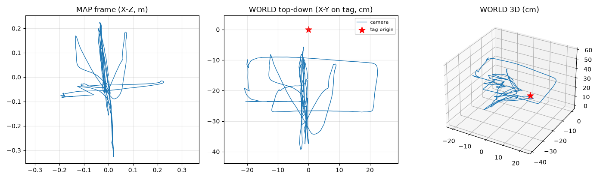
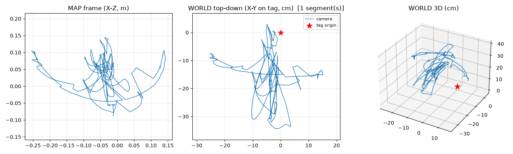

# GoPro HERO7 Black



| 샘플 (공원) | 캘리브레이션 보드 |
|---|---|
|  |  |

## 측정 스펙 (이 데이터셋에서 실측)

| 항목 | 값 |
|---|---|
| 영상 모드 | 2704×2028 (4:3) @ 59.94 fps, H.264 |
| **FOV (실측)** | **H 120.5° / V 93.7° / D 146.6°** |
| 텔레메트리 | MP4 `gpmd` 트랙 (GPMF) — 순수 Python 파서로 추출 |
| IMU | ACCL/GYRO **197.7 Hz** |
| 가속도계 품질 | \|g\| = 9.49 m/s² (**-3.3% 스케일 오차**) |
| IMU-영상 시간 오프셋 | **-53 ms** (imu_sync로 자동 추정, 반복 ±2 ms) |
| 안정화 | HyperSmooth **OFF 필수** (udta GPMF `EISE=N`으로 확인 가능) |
| 주의 설정 | 자동 저조도(`VLTE`)도 끄는 것 권장 |

## 캘리브레이션 (KB4 fisheye)

- fx=1215.0, fy=1217.3, cx=1343.3, cy=1030.4 / k1~k4 = 0.0476, 0.0191, -0.0109, 0.0023
- RMS **0.826 px** (60뷰), 전 프레임 확장 평균 0.65 px — 가장자리 발산 없음
- **FOV: H 120.5° / V 93.7° / D 146.6°** (GoPro Wide 4:3 명목치와 일치)
- 커버리지: 10×8 셀 중 78셀에 100+ 샘플



## 결과

| 영상 | 환경 | 결과 |
|---|---|---|
| GX014219 | 공원 산책로 | 전 구간 궤적 (99.7%, 174 m) |
| GX014220 | 연못 공원 | 클린 완주 + 맵 저장 (91.5%, 307 m) |
| GX014221 | 보도 | 부분 궤적 (최대 맵 53%) |
| GX014217 | 전시홀(무지 파티션) | **실패** — 아틀라스 분절 (연구노트 §3-1) |




**근거리 정밀도** (ChArUco 기준 대비, 보드 15~63 cm 거리 48초):
ATE **RMSE 1.88 cm** (rigid) / 0.34 cm (similarity, 스케일 계수 1.126)



### UMI 그리퍼 검증 (2026-07-07)

그리퍼 장착 + 화면 하단 33% 마스킹 상태로 여닫음/pick&place 데모 **99.5/100%
추적**(단일 세그먼트), id13 태그 월드 앵커 잔차 0.23 cm. 한계: 던지기급
고속 모션은 50%로 조각남(블러/198 Hz IMU — 매칭된 맵으로도 회복 안 됨).
상세는 [UMI 검증 문서](../../docs/umi_gripper_pipeline.md).




## 알려진 한계

- 가속도계 -3.3% 스케일 오차 → IMU 스케일 계수 1.126으로 나타남
- 무지 벽/파티션이 시야를 채우는 실내(전시홀)에서 맵 분절 — FOV 120°의 한계
- 컨테이너의 구형 FFmpeg가 2.7K 원본을 못 읽음 → 사전 트랜스코딩 필수(파이프라인이 자동 처리)

## HDMI 캡처 경로 (MacroSilicon 동글)

HERO7은 웹캠 모드가 없어 라이브 스트림은 HDMI→USB 캡처 동글 경유가 유일:
`/dev/v4l/by-id/usb-MACROSILICON_USB3._0_capture-video-index0`, 녹화는
`scripts/hdmi_record.sh` (장치 단일 오픈 유지 — 닫으면 핫플러그로 GoPro 리셋).

실측 특성:

| 항목 | 값 |
|---|---|
| **종단 지연 (직접 측정, 720p60)** | **median 186 ms, p10 131 / p90 227** — Ace Pro 2(163 ms, 지터 40 ms)보다 중앙값 +23 ms, 지터 2.4배 |
| 안정 포맷 | **720p@60 권장** — 60 fps 1:1 매핑으로 동글 프레임 블렌딩 없음. 1080p30은 인접 프레임 평균(이중상), 1080p60은 USB2 대역폭 초과로 프레임 손상 |
| 기하 (4:3 모드 프리뷰) | **SuperView식 비선형 스트레치** — 방사대칭 모델 부적합 (calibration/hdmi는 중심부 근사). 네이티브 16:9 모드로 바꾸면 해소될 가능성 |
| 체감 지연 주의 | ffplay 등 뷰어의 표시 버퍼링이 0.3~0.5 s를 더해 보임 — 실제 캡처 지연과 구분할 것 |

## 사용법

```bash
python -m gopro_vio.extract data/hero7black/GX014222.MP4 -o output/GX014222
python -m gopro_vio.charuco data/hero7black/GX014222.MP4 -o cameras/hero7black/calibration \
    --squares 10 8 --square-size 0.023
python -m gopro_vio.imu_sync cameras/hero7black/calibration/board_poses.npz \
    output/GX014222/imu.csv -o cameras/hero7black/calibration
python -m gopro_vio.slam data/hero7black/GX014219.MP4 --imu output/GX014219/imu.csv \
    -o output/GX014219/slam --calib cameras/hero7black/calibration/intrinsics.json \
    --extr cameras/hero7black/calibration/imu_extrinsics.json
```
