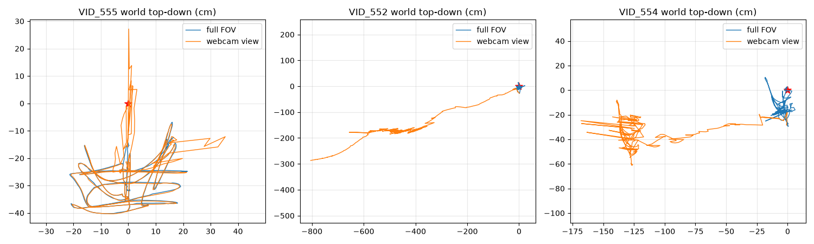

# UMI 그리퍼 파이프라인 — end-to-end 검증 기록

> **상태: 검증(validation)이지 완성이 아님.** 마커 크기·id, 마스크 형상,
> 너비 오프셋 등 구체 설정은 리그가 바뀌면 달라진다. 이 문서의 목적은
> **"카메라 화면 일부가 그리퍼에 가려져도 궤적 생성이 충분히 된다"**는
> 핵심 가설을 실측으로 확인한 과정과 그때 배운 것들을 남기는 것이다.
> (측정 2026-07-07, HERO7 + Ace Pro 2, 자체 그리퍼 리그)

UMI(rs_slam/umi_pipeline의 D435i 시도 포함) 방식의 데이터 수집을
액션캠 VIO 파이프라인 위에 얹었다: ArUco 원점 태그(id13)로 월드 프레임을
잡고, 그리퍼 손가락 마커(id0/1)로 너비를 읽고, ORB-SLAM3 mono-inertial로
카메라 궤적을 복원한다.

## 핵심 결과

| 검증 항목 | 결과 |
|---|---|
| **그리퍼 가림(화면 33~36% 마스킹) 상태 궤적** | **HERO7 99.5~100%, Ace Pro 2 4/4편 100% 추적(단일 세그먼트)** — 던지기 포함 |
| 월드 앵커 정밀도 (id13 고정점 잔차) | median 0.23~0.67 cm |
| 스케일 보정 (태그 크기 기지 이용) | 맵마다 −2.6~−9.7% 편차를 태그로 보정 — **맵별 스케일 추정이 필수** |
| 그리퍼 너비 신호 (id0/1, 18 mm) | 연속 추출, 프레임 간 노이즈 0.2~0.4 mm |

## 왜 데모 녹화와 별도로 id13 맵핑 영상이 필요한가

데모(궤적) 영상만으로는 안 되는 이유가 세 겹이다. 맵핑 영상 한 편이
그 세 가지를 한 번에 공급한다.

**1) 월드 원점·자세 앵커.** SLAM 궤적은 "맵 프레임"(첫 키프레임 기준
임의 원점)에 나온다. 태그가 보이는 모든 프레임에서
`T_map_tag(i) = T_map_cam(tᵢ)·T_cam_tag(i)` 를 모아 강건 평균하면
`T_world_map`을 얻고, 월드 좌표계 = 태그 좌표계가 된다. 위치만이 아니라
**방향까지** 앵커된다 — 태그를 테이블에 평평히 두면 월드 z축 = 테이블 법선.

**2) 미터 스케일 (태그 = 미터자).** 크기를 아는(100 mm) 마커의 PnP는
매 프레임 카메라→태그 벡터 pᵢ를 **진짜 미터**로 준다. 마커 하나를
사진 한 장으로 보면 맵 스케일을 못 재지만, **움직이며 여러 위치에서 보면**
가능하다: 태그는 고정이므로 모든 프레임에서

```
cᵢ + s·(Rᵢ pᵢ) = X    (cᵢ,Rᵢ: SLAM 포즈[맵 단위], pᵢ: PnP[m], s: 맵단위/m, X: 태그 위치)
```

미지수는 X(3)+s(1)뿐이고 프레임마다 식 3개가 나와, 수백 프레임 최소제곱으로
s를 푼다. 직관: 실제 10 cm 다가가면 PnP가 미터로 말해주고 SLAM은 맵 단위로
말하니 그 비가 스케일이다. mono-inertial 스케일은 실측 −2.6~−9.7%로 맵마다
흔들려서 **맵별 스케일 추정이 필수**다 (스테레오였던 원조 UMI/rs_slam에는
없던 단계). 태그 고정점 잔차(median 0.23~0.67 cm)가 품질 지표.

**3) 데모가 스스로 설 수 없기 때문.** 데모 영상에는 태그가 안 보이고
(그리퍼는 작업 공간을 본다), 단독 SLAM은 접근-모션 초기화 취약(연구노트
§1)으로 초기화 자체가 실패한다. 데모는 맵핑 영상이 만든 맵에
`--load-map`으로 localize되어 **월드 앵커와 스케일을 그대로 상속**받는다.
덤으로, 맵핑 영상 자신은 내장 태그 초기화(`--init_tag_id 13`)로 시작부터
바른 포즈·스케일로 선다 — `--init_tag_size`(기본 0.16)를 실제 크기로
넘기지 않으면 초기 스케일이 틀어지니 주의.

## 워크플로 (검증에 사용한 형태)

마커 설정은 `configs/umi_aruco.yaml` (DICT_4X4_50; id13=100mm 원점,
id0/1=18mm 손가락 — **리그 바뀌면 이 파일과 `--init_tag_size`만 수정**).

```bash
# 0. IMU 추출 + (카메라별) 캘리브레이션은 기존 파이프라인 그대로

# 1. 맵 영상: 그리퍼 장착 + 물체 배치 상태에서 id13이 보이게 스윕
python -m gopro_vio.slam <맵영상> --imu ... -o output/<맵>/slam \
    --mask cameras/<모델>/calibration/gripper_mask.png --init_tag_size 0.10
python -m gopro_vio.aruco_detect <맵영상> --calib ... -o output/<맵>/tags.pkl --step 2 --ids 13
python -m gopro_vio.world_align output/<맵>/tags.pkl \
    output/<맵>/slam/camera_trajectory.csv -o output/<맵>/world   # T_world_map + 스케일

# 2. 데모 영상: 맵에 localize → 맵의 월드 변환을 그대로 적용
python -m gopro_vio.slam <데모> --imu ... -o output/<데모>/slam \
    --load-map output/<맵>/slam/map_atlas.osa --mask ... --init_tag_size 0.10
python -m gopro_vio.world_align --apply output/<맵>/world/tx_slam_tag.json \
    output/<데모>/slam/camera_trajectory.csv -o output/<데모>/world

# 3. 그리퍼 너비 (원본 해상도에서 검출)
python -m gopro_vio.aruco_detect <데모> --calib ... -o output/<데모>/tags.pkl --step 1 --ids 0 1
python -m gopro_vio.gripper_width output/<데모>/tags.pkl -o output/<데모>/gripper
```

마스크 생성: `scripts/make_gripper_mask.py` (사다리꼴; 손가락이 여닫는
동안 쓸고 가는 영역 전체를 덮는다. 현재 값은 이 리그 실측).

## 검증에서 배운 것 (촬영 프로토콜에 반영할 것)

1. **맵 영상은 "데모와 같은 조건"으로**: 그리퍼 장착 + 물체 배치 상태로
   id13을 비추며 스윕. 빈 테이블/무그리퍼 맵은 데모 재추적이 안 붙는다
   (HERO7 손데모 22% ← 빈 테이블 맵). 태그가 안 보이는 데모는 맵
   localize가 유일한 월드 앵커 수단이며, 맵 없이 단독 실행하면
   접근-모션 초기화 취약(연구노트 §1)으로 초기화 자체가 실패한다.
2. **그리퍼 가림은 문제가 아니라 오히려 유리**: 마스크로 33~36%를 제외해도
   전 데모 완주. 그리퍼가 카메라-물체 **최소 이격(~17 cm)을 강제**해서
   근접-평면 스케일 폭주 영역(연구노트 §4)에 아예 들어가지 않는다.
   손으로 든 데모는 0~7 cm까지 내려가며 조각났다.
3. **FOV가 재추적·드리프트 억제의 지배 요인** (통제 실험): 같은 영상을
   웹캠 기하(H114°/V70°)로 크롭하면 — 같은 센서·같은 IMU — 손데모는
   100%→47%로 붕괴하고, 그리퍼 데모는 "100% 추적"으로 표시되면서
   **조용히 0.5~8 m 표류**한다(같은 영상의 풀FOV 궤적과 비교; 검증용
   기준인 맵 영상 자신은 두 기하에서 0.31 cm 일치). 교훈 둘:
   **궤적 라벨은 반드시 풀 녹화 FOV로 추출**할 것, 그리고 **추적률만으로
   품질을 판단하지 말 것**(위치 일치도가 진짜 지표).
   
4. **고속 모션은 FOV가 아니라 카메라가 한계**: HERO7 던지기는 매칭된
   맵을 줘도 못 살아난다(50%→31%) — 블러/롤링셔터/198 Hz IMU.
   같은 조건의 Ace(994 Hz, 더 큰 센서)는 100%. V-FOV 순서로도 일관:
   87°(D435i, 파국) < 70°크롭(표류) < 93.7°(HERO7, 동작) < 104°(Ace, 견고).
5. **너비는 "신호"까지 검증, "값"은 미완**: 마커 x거리 신호는 연속·저노이즈
   (0.2~0.4 mm)지만, 이 그리퍼는 가위식(손가락 회전)이라 마커 거리↔실제
   조 간격 매핑과 오프셋 캘리브레이션은 남아 있다. 웹캠(롤아웃) 뷰에서는
   마커가 화면 밖 — 너비는 학습 데이터에서만 관측 가능.
6. **궤적 = 카메라 광학 중심**: TCP(그리퍼 끝) 궤적은 `T_cam_tcp` 고정
   변환(rs_slam calibrate_cam_tcp 방식) 캘리브레이션 후 얻는다 — 미완.

## 남은 작업

- [ ] `T_cam_tcp` 캘리브레이션 (마커중심→손끝 오프셋 실측 필요)
- [ ] 너비 오프셋/가위식 기구학 매핑 튜닝
- [ ] 에피소드 통합 출력 (per-frame `T_world_tcp` + `gripper_width` CSV → LeRobot)
- [ ] 고속 데모 개선 실험: 60 fps 직접 SLAM(`--fps-div 1`), 셔터 속도 고정

결과 아티팩트: `cameras/hero7black/results/umi/`, `cameras/acepro2/results/umi/`
